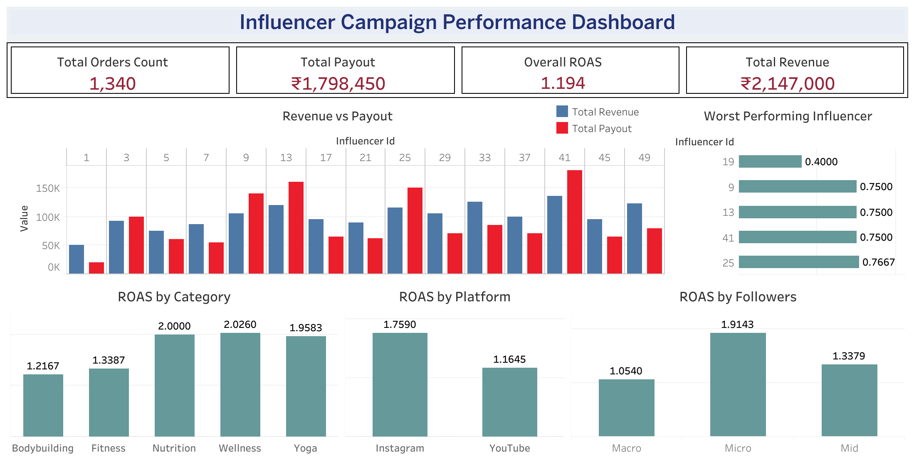

# Influencer Campaign Performance Analysis

This project analyzes influencer marketing performance using SQL and visualizes insights through a Tableau dashboard.

## Objective
Evaluate campaign efficiency using ROAS (Return on Ad Spend) and identify high-performing influencers, platforms, and product segments.

## Tech Stack
- SQL (Databricks)
- Tableau (Dashboard)
- Data Modeling (fact + dimension approach)

## Key Insights
- Micro influencers outperform macro influencers in ROAS
- Instagram campaigns deliver higher returns than YouTube
- A small group of influencers drives most of the profitability
- Some campaigns generate revenue but are not cost-efficient

## Dashboard

## Project Structure
- `data_modeling.sql` → table creation and data modeling
- `analysis.ipynb` → queries, outputs, and insights
- `final_dataset.csv` → dataset used for dashboard

## Outcome
Provides actionable insights on where to allocate marketing budget for maximum ROI.

## Live Dashboard
[View on Tableau Public](https://public.tableau.com/app/profile/divjyot.singh.suri/viz/HealthKartInfluencerPerformanceDashboard/Dashboard1)
